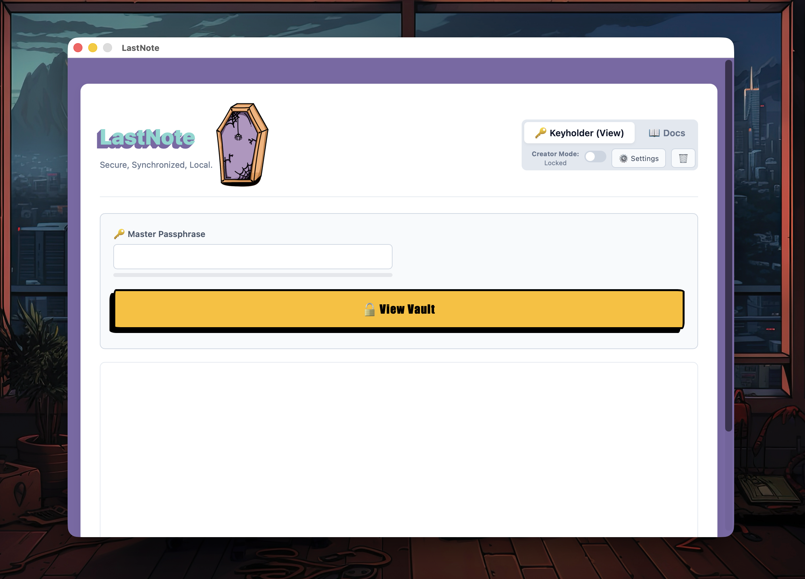

# [LastNote](https://zoisroupas.dev/lastnote/)

<kbd></kbd>

<p align="center">
  <a href="https://gitlab.com/paparoup/lastnote">
    
  </a>
  <a href="https://jekyllrb.com/">
    
  </a>
</p>

A responsive, single-page Jekyll landing page for **LastNote**, a desktop application which encrypts and stores locally all the important notes, instructions, accounts and any other information that can be then securely shared with your loved ones.

Styled with a high-contrast editorial aesthetic, dynamic day/night modes, tactile postmark accents, and no external CSS frameworks.

## Design notes.

* **High-Contrast Editorial Aesthetic:** Strong tactile borders, offset hard drop-shadows, bold typography (`Impact`/`Arial Black` accents), and postmark-style stamp tags.
* **Dynamic Day / Night Themes:** Automatically adapts based on the visitor's local time (Night mode active between 19:00 and 06:00) with a persistent manual toggle (`sessionStorage`).
* **Interactive Elements:** Smooth anchor scrolling, scroll-reveal card animations via `IntersectionObserver`, mobile-responsive navigation drawer, and an embedded demo modal.
* **Privacy & Analytics:** GDPR-compliant Google Analytics (GA4) integration that only triggers upon explicit visitor consent via an interactive banner.
* **Handwritten Sass:** Clean, modular SCSS without reliance on heavy frontend frameworks like Bootstrap or Tailwind.

## Run it locally

You'll need Ruby and Bundler installed.

```bash
bundle install
bundle exec jekyll serve

# To test production-only features (e.g., GDPR banner) locally:
JEKYLL_ENV=production bundle exec jekyll serve 
```
Then open http://127.0.0.1:4000/lastnote/.

## What to edit first

1. **`_config.yml`** — set `url`, `baseurl`, `email`, and the real
   `download.mac_url` / `download.windows_url` links (currently `#`
   placeholders), plus OS requirements.
2. **`index.html`** — the feature cards and "how it works" steps are
   written generically (local-first, encrypted, organized, exportable).
   Swap in your app's actual features and copy.
3. **`assets/images/`** — drop in a real app screenshot and swap the
   CSS-only `.mock-window` mockup in `index.html`'s hero for an `` if
   you'd rather show the real UI.
4. **Favicon / meta image** — add one to `assets/images/` and reference it
   in `_layouts/default.html`.

## Deploy to GitHub Pages

1. Push this repo to GitHub.
2. In the repo's Settings → Pages, set the source to the branch you pushed
   (e.g. `main`) and folder `/ (root)`.
3. Update `url` and `baseurl` in `_config.yml` to match your GitHub Pages
   URL (baseurl is the repo name if it's a project page, e.g.
   `/lastnote`; leave it empty if this is a `username.github.io` repo).
4. Push — GitHub Pages builds Jekyll sites automatically, no local build
   needed.

## License

[MIT](./LICENSE.md)
